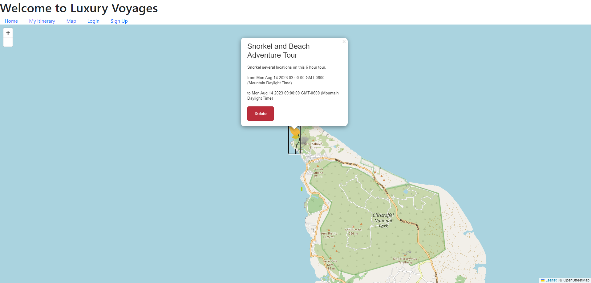

# LuxuryVoyages
Making luxury travel easy!

## Contributors
* Jeneva Ray - Backend & Mapping
* Trevor Miller - Itinerary
* Quinton Palfreyman - Landing Page

## Description
We wrote this app to help people keep track of things they would like to do while on vacation.

# Technologies New to Us, which were used
* frontend: flatpickr (date picker) & leaflet (mapping system)
* backend: wiki-voyages-listings (90MB CSV -> 122MB SQL) - see below for access

## Features
* Full user sessions support (including timeouts)
* Custom Leaflet.js UI additions (colored markers, create-an-itinerary from wiki entry, create-an-itinerary from map location)
& the ability to delete created itinerary markers.
* Bootstrap modals for itinerary creation.
* full HTTPS compatibility, including with session cookies.

## To Do List
Polish the HTML portions of the site.
Business partnerships with destinations.

## Screenshot

## Installation
* `git clone git@github.com:JenevaRay/LuxuryVoyages.git`
* create `.env` file with format outlined in `.env.EXAMPLE`
* `npm i`
* `mysql -u {user} -p luxuryvoyages` -> `source db/schema.sql` -> `exit`
* `node server.js`
* navigate to `localhost:3001` (or other port, as overridden in server.js)

## Usage
* Check out the live installation at `https://hidden-sierra-19402-e64d4351653d.herokuapp.com/`

## Credits
* [leaflet](https://leafletjs.com) 
* [wiki-voyage-listings CSV](https://data.world/nicolas-raoul/wikivoyage-points-of-interest/workspace/file?filename=wikivoyage-listings-en.csv)

## Commentary
A lot of work was done rapidly, with the loss of a team member, we thought it would have to be delayed or features cut, but considering, I think we did pretty well delivering a full-featured product with fewer people than we needed!

## Presentation
Here's the link to our powerpoint for our presentation: https://drive.google.com/file/d/1B10xLYOaPVkwqduRhNhInucZR32Nz4wA/view?usp=sharing
